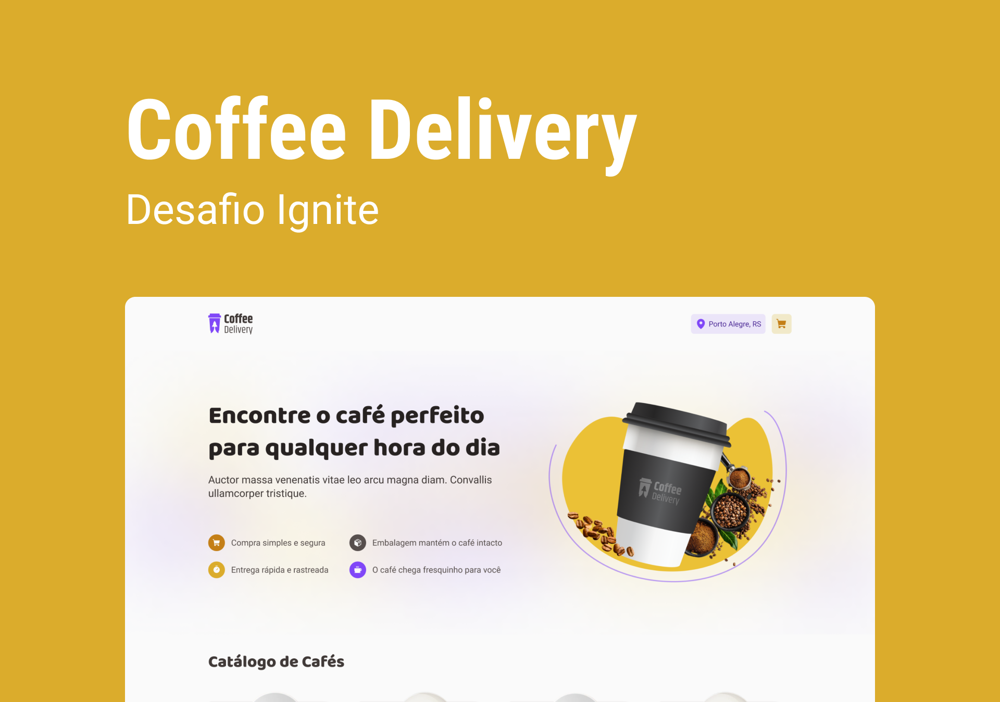

<div align="center">
	<h1>Coffee Delivery ☕🛵</h1>
	<br>
	
</div>

# Overview

Application to manage a shopping cart of a fictitious coffee shop. The objective is to practice the concepts of ReactJS like ContextAPI, LocalStorage, lists and keys, properties and componentization.

# UI

[Click here](https://www.figma.com/file/f8Pd3QDmAjB0YSFD63wTcw/Coffee-Delivery-(Copy)?node-id=0%3A1&t=acr9JdPQqlicCipd-0) to access the UI design.

# Requirements

- [X] Show a list of coffees available for shopping.
- [X] Add items on cart
- [X] Increase, decrease or change items quantity on cart
- [X] Address form
- [X] Show quantity of selected items on Coffee Icon on Header
- [X] Show total price

# Run locally

<h3>How to run it on your computer</h3>

- Install [Node.js](https://nodejs.org/en/download/), [Yarn](https://classic.yarnpkg.com/lang/en/docs/install/) and [Git](https://git-scm.com/book/en/v2/Getting-Started-Installing-Git), then:

```
# clone this repo
$ git clone https://github.com/felipejsborges/coffee-delivery.git

# go to project folder
$ cd coffee-delivery

# install dependencies
$ yarn

# run the app
$ yarn dev
```
<hr>